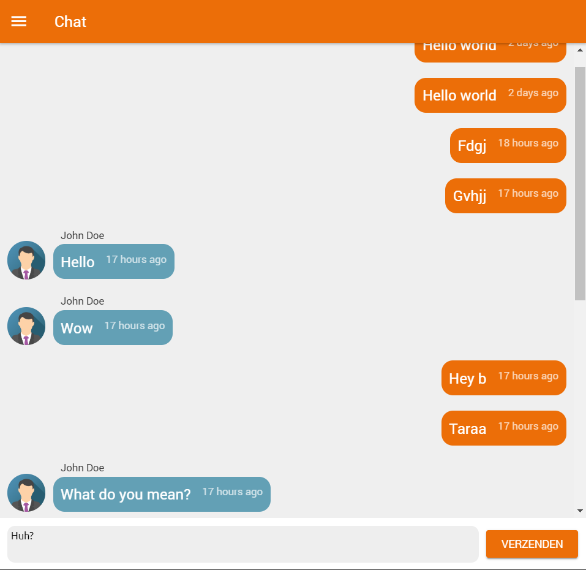

# feed-view

feed-view provides chat like scroll behaviour. The element's scroll, sticks to the bottom when new elements are added and doesn't jump when new elements are added above the element's scrolltop.

[](https://github.com/LesterGallagher/feed-view/blob/master/LICENSE)
[](https://github.com/LesterGallagher/feed-view/issues)
[](https://twitter.com/intent/tweet?text=Wow:&url=https%3A%2F%2Fwww.npmjs.com%2Fpackage%2Ffeed-view)

You've created an chat an and you want to add simple chat like scroll behaviour:



You can use this simple 1kb module to manage scroll behaviour for you. This module works for any html container that receives new children dynamically. If the scrolled all the way to the bottom, the bottom will stick. When new elements are added on above the current scroll view, this module will maintain the right amount of scroll.

## Installation

### Node

```bash
npm i -S feed-view
```

```javascript
const FeedView = require('feed-view');
// or
import FeedView from 'feed-view'; // if you're using es6
```

### Browser

CDN: https://cdn.jsdelivr.net/npm/feed-view/dist/feed-view.min.js

```html
<script src="https://cdn.jsdelivr.net/npm/feed-view/dist/feed-view.min.js"></script>
<script>
  // "FeedView" is now a global variable
</script>
```

## Usage

```javascript
var container = document.querySelector('#container'); // the scrolling element
var feedView = new FeedView(container);

console.log(view.container); // the scrolling element
console.log(view.sticky); // is the scrolling element currently sticked to the bottom
```

Everytime you add an element or right after you've added multiple elements, 
call ".update()" on the feediew instance. This scrolls the scrolling element if nessecary
and updates the state.

```javascript
setTimeout(() => {
  container.appendChild(document.createTextNode('Message 1'));
  feedView.update();
}, 1000);

setTimeout(() => {
  container.appendChild(document.createTextNode('Message 2'));
container.appendChild(document.createTextNode('Message 3'));
  feedView.update();
}, 1000);
```
